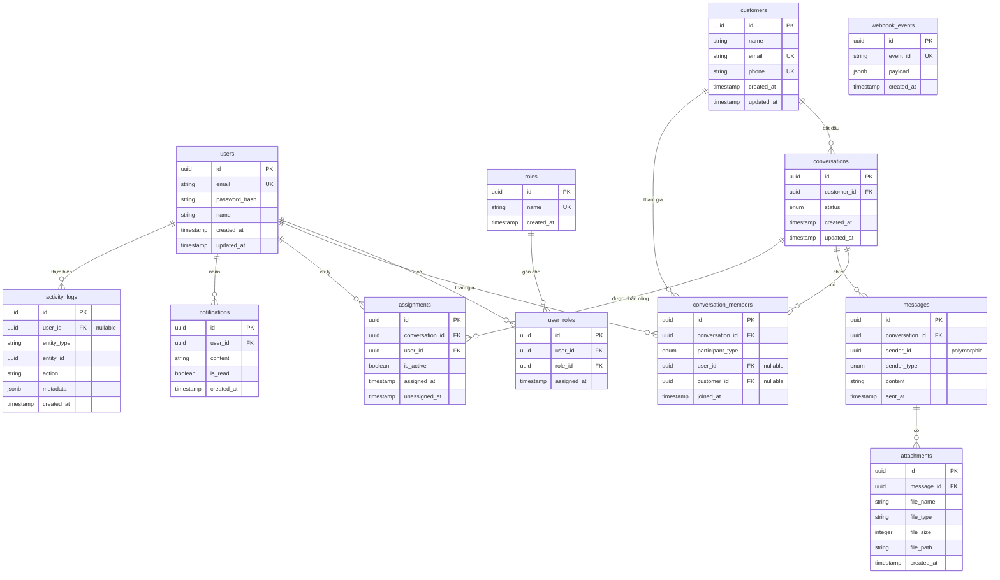

# Phân tích cơ sở dữ liệu — CRM Backend (Challenge 1)

## 1. Tổng quan
Hệ thống cơ sở dữ liệu hỗ trợ nền tảng Realtime CRM / Customer Support. Hệ thống được thiết kế để quản lý người dùng (nhân viên, quản trị viên), khách hàng, hội thoại, tin nhắn đa hình, phân công nhân viên, thông báo và lịch sử hoạt động.

## 2. Sơ đồ thực thể quan hệ (ERD)

---

## 3. Danh sách các bảng chi tiết

### 3.1. `users`
Lưu trữ thông tin nhân viên nội bộ hệ thống (nhân viên hỗ trợ, admin).
- Khóa chính `id` sử dụng kiểu dữ liệu `UUID`.
- `password_hash` lưu trữ mật khẩu đã mã hóa.

### 3.2. `roles`
Các vai trò phân quyền như `ADMIN`, `STAFF`.
- Khóa chính `id` sử dụng kiểu `UUID`.

### 3.3. `user_roles`
Bảng trung gian thể hiện mối quan hệ n-n giữa `users` và `roles` (một user có thể có nhiều vai trò).

### 3.4. `customers`
Lưu trữ thông tin khách hàng liên hệ hỗ trợ.
- `email` và `phone` có ràng buộc duy nhất (Unique) để tránh trùng lặp.

### 3.5. `conversations`
Cuộc hội thoại giữa khách hàng và bộ phận hỗ trợ.
- Trạng thái `status` gồm: `OPEN`, `ASSIGNED`, `PENDING`, `CLOSED`.

### 3.6. `conversation_members`
Bảng lưu trữ thành viên tham gia hội thoại. 
- **Thiết kế Đa hình (Polymorphic)**: Hỗ trợ cả nhân viên (`user_id`) và khách hàng (`customer_id`) thông qua enum `participant_type`.
- **Ràng buộc kiểm tra (Check Constraint)**: Đảm bảo chỉ một trong hai cột `user_id` hoặc `customer_id` được điền tại một thời điểm, khớp với giá trị của `participant_type`.

### 3.7. `messages`
Lưu trữ tất cả các tin nhắn trong một cuộc hội thoại.
- **Người gửi đa hình**: Người gửi (`sender_id`) có thể là nhân viên hoặc khách hàng, phân biệt bằng cột `sender_type`. Do đó không thiết lập khóa ngoại cứng trỏ tới `users` ở DB.

### 3.8. `assignments`
Ghi nhận việc phân công cuộc hội thoại cho nhân viên hỗ trợ.
- **Ràng buộc Duy nhất Một phần (Partial Unique Index)**: Một cuộc hội thoại tại một thời điểm chỉ có tối đa một nhân viên đang hoạt động hỗ trợ (`is_active = true`). Lịch sử các lần chuyển giao trước đó (`is_active = false`) vẫn được lưu lại đầy đủ.

### 3.9. `notifications`
Thông báo gửi tới nhân viên khi có sự kiện mới phát sinh (vd: tin nhắn mới, phân công mới).

### 3.10. `webhook_events`
Lưu trữ log webhook nhận được từ các nền tảng tích hợp để đảm bảo tính bất biến và xử lý trùng lặp (idempotency) bằng `event_id`.

### 3.11. `attachments`
Các file đính kèm đính kèm trong tin nhắn (`messages`).

### 3.12. `activity_logs`
Nhật ký kiểm toán hệ thống (Audit log).
- Thiết kế dạng thực thể chung: Sử dụng `entity_type` (tên bảng), `entity_id` (id dòng) và cột `metadata` (JSONB) để ghi nhận chi tiết bất kỳ thay đổi nào từ phía nhân viên hoặc khách hàng.

---

## 4. Bảng Index & Unique Constraints nâng cấp

| Bảng | Ràng buộc duy nhất (Unique) | Chỉ mục (Index) | Ghi chú |
| :--- | :--- | :--- | :--- |
| **users** | `email` | `email` | Tìm kiếm và đăng nhập nhanh |
| **roles** | `name` | — | Vai trò là duy nhất |
| **user_roles** | `(user_id, role_id)` | `user_id`, `role_id` | Ràng buộc n-n |
| **customers** | `email`, `phone` | `name` | Tìm kiếm khách hàng theo tên |
| **conversations** | — | `customer_id`, `status` | Truy vấn hội thoại theo bộ lọc |
| **conversation_members** | `(conversation_id, user_id, customer_id)` | `conversation_id`, `user_id`, `customer_id` | Ngăn một người tham gia trùng |
| **messages** | — | `(conversation_id, sent_at)`, `sender_id` | Tối ưu hóa việc tải tin nhắn theo thứ tự thời gian |
| **assignments** | `(conversation_id) WHERE (is_active = true)` | `conversation_id`, `user_id` | Đảm bảo duy nhất 1 nhân viên hỗ trợ active |
| **notifications** | — | `user_id` | Lấy danh sách thông báo của user |
| **webhook_events** | `event_id` | `event_id` | Đảm bảo xử lý sự kiện idempotent |
| **attachments** | — | `message_id` | Tải các đính kèm của tin nhắn |
| **activity_logs** | — | `user_id`, `(entity_type, entity_id)` | Tối ưu hóa tìm lịch sử thay đổi của thực thể |
